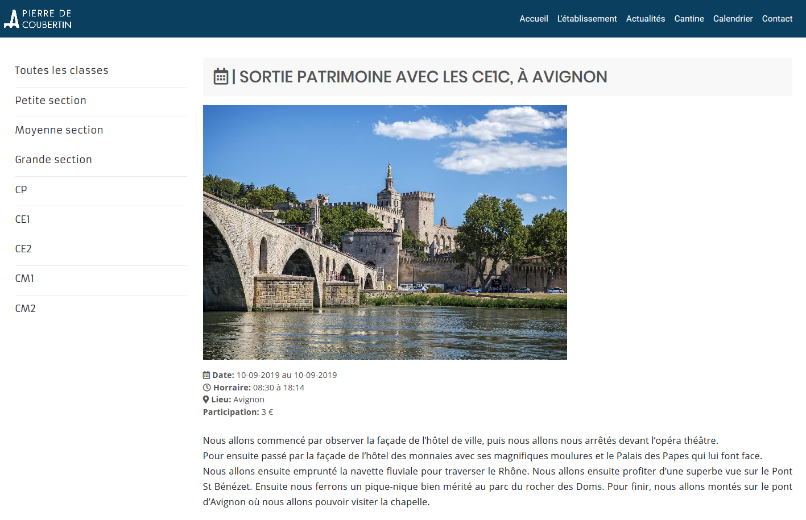

NextEvents is a WordPress plugin who add a calendar were you will be able to pin every single events who gonna take place in the futur.
Easy to use and very intuitive, this plugin is the better way to add a calendar to your website without any development knowledge.

⚠️ Warning : This theme work on WordPress 5.0+ ⚠️

## Installation

### Step 1 - Install the plugin

1) First of all, go into your website FTP
2) Go inside wp-content > themes
3) Download the plugin

Download the [zip file](https://github.com/qanastek/Next-Events/archive/master.zip) from GitHub.

or

```bash
Git clone https://github.com/qanastek/Next-Events.git
```

4) If you download the zip file, extract it here

### Step 2 - Enable it

1) Go to your administrator panel
2) Enable the plugin inside the plugins section

## Technical informations

Mainlly built with **JavaScript** (For the entire plugin) and **React** (For the WordPress Block Editor side)

## More infos about my choice to run it on 5.0+

This plugin was build for WorPress 5.0+ because I want to make it as intuitive as I can for the mainstream wordpress users who can be very fastlly lost and make mistakes with shortcode, etc ...

## Pictures





